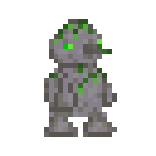
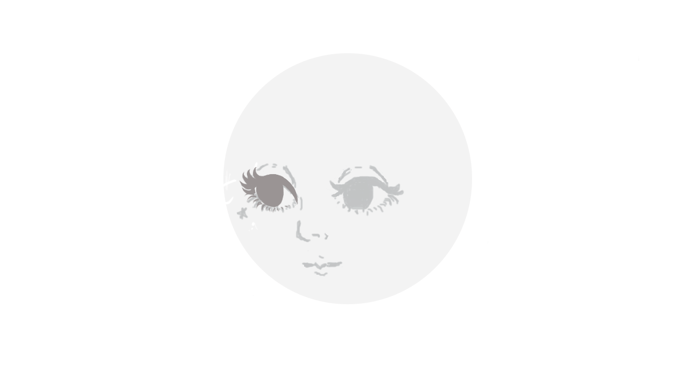
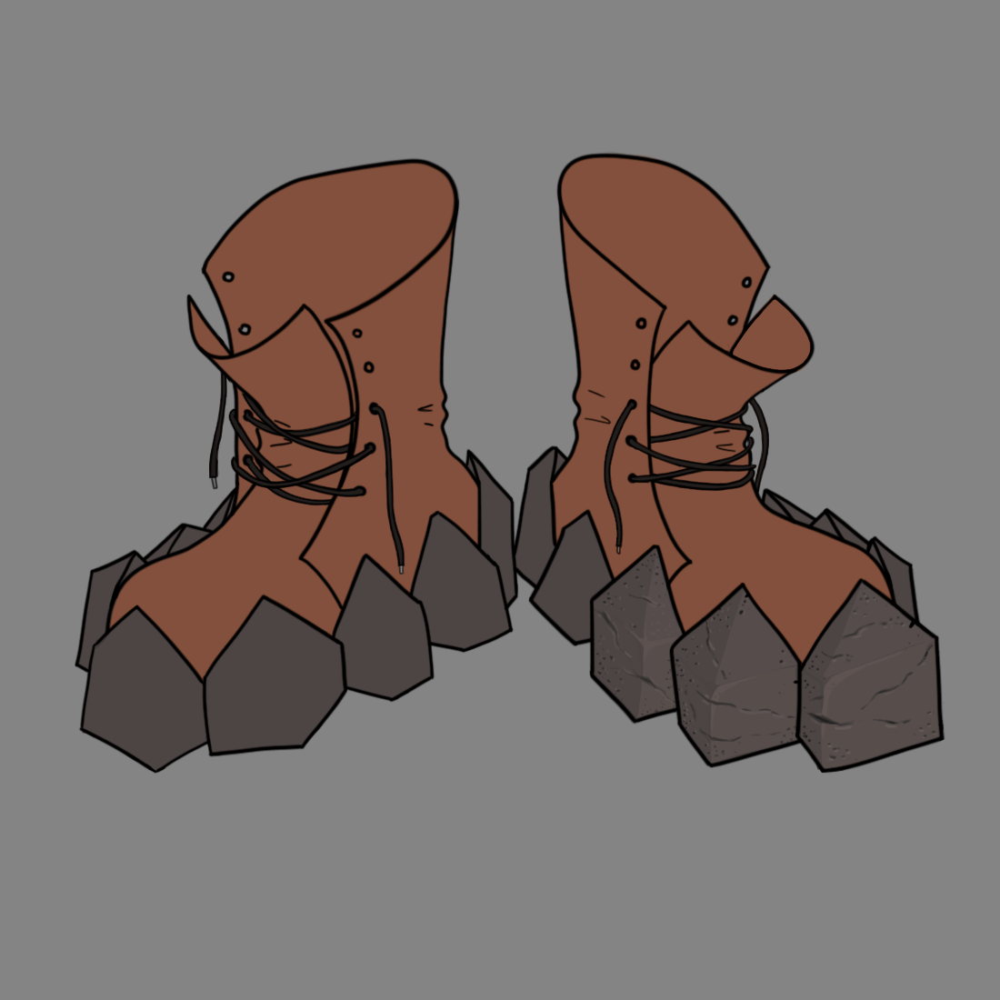
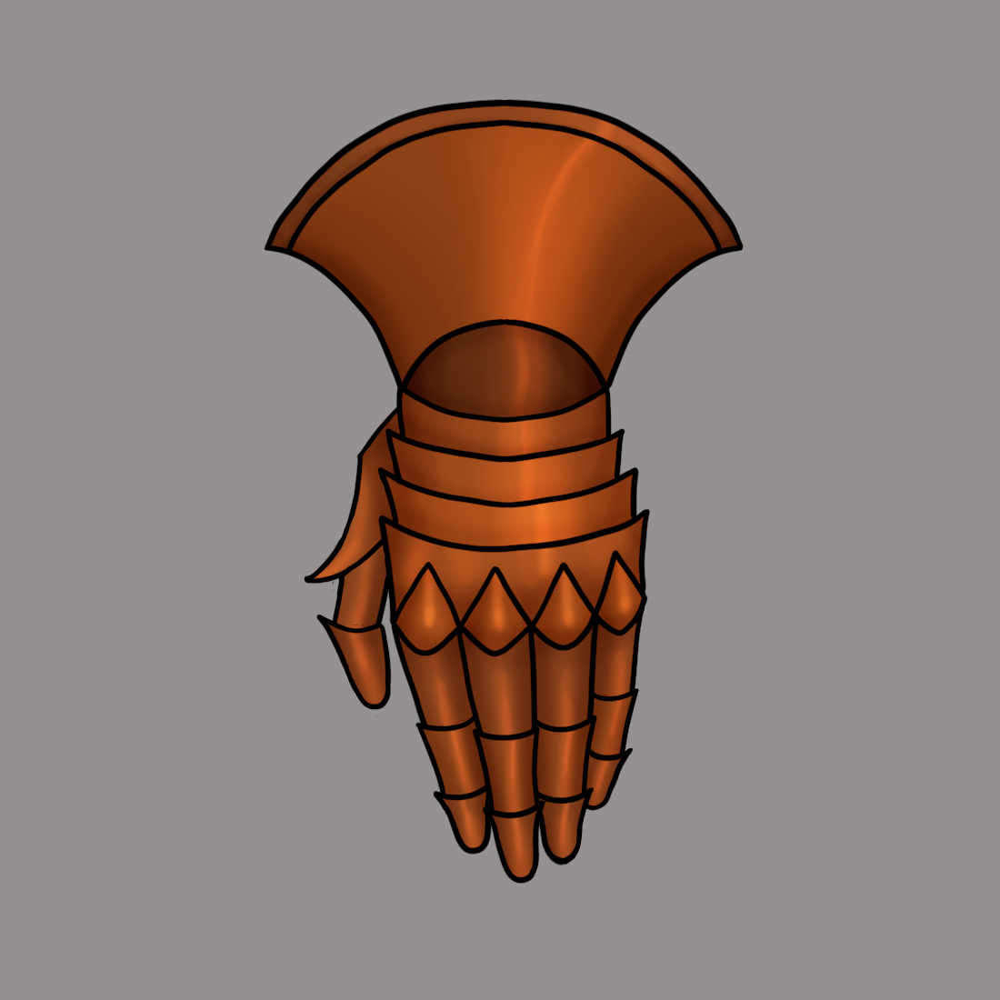
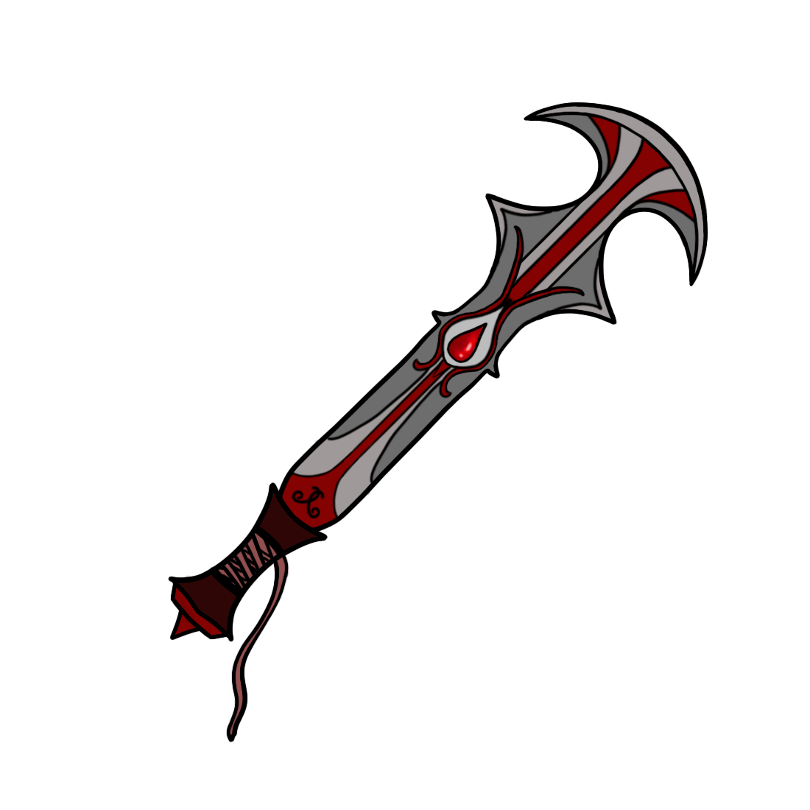
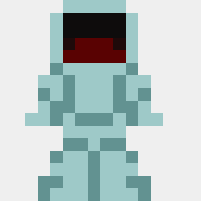
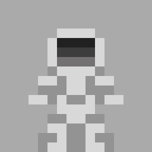
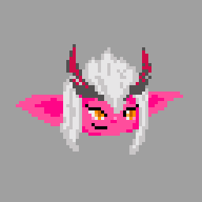

# portfolio
Amostra de algumas das artes que criei com o passar dos anos
A maioria delas não está finalizada, porém, acho que mostra bastante do que sei fazer com pixel art e pintura digital!
Esse solzinho criei para fazer um plano de fundo animado, em um dos projetos que comecei faz muuuito tempo! 

Esse aqui criei para um projeto que fiz em grupo, que era uma Game Jam. Era um inimigo.

Uma ilustração que seria um dia uma splash art, que nunca finalizei :(

As próximas 3 imagens, criei para um amigo quando ele estava fazendo o jogo dele e me pediu ajuda com as artes :)
Essa aqui era uma bota "de pedra" (também não finalizei)

Uma manopla de cobre

e uma espada de sangue

Dois astronautas aleatorios (faz tanto tempo que nem lembro qual era o projeto que eu tava tentando fazer)

Uma vez q eu desenhei a satristanica formato pixel art

