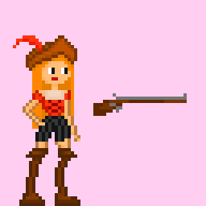

# Portifólio
Amostra de algumas das artes que criei com o passar dos anos 
A maioria delas não está finalizada, porém, acho que mostra bastante do que sei fazer com pixel art e pintura digital! 
***
Esse solzinho criei para fazer um plano de fundo animado, em um dos projetos que comecei faz muuuito tempo!  
 
***
Esse aqui criei para um projeto que fiz em grupo, que era uma Game Jam. Era um inimigo. 
 
***
Uma ilustração que seria um dia uma splash art, que nunca finalizei :( 
 
***
As próximas 3 imagens, criei para um amigo quando ele estava fazendo o jogo dele e me pediu ajuda com as artes :) 
Essa aqui era uma bota "de pedra" (também não finalizei) 
 
Uma manopla de cobre 
 
e uma espada de sangue 
 
***
Dois astronautas aleatorios (faz tanto tempo que nem lembro qual era o projeto que eu tava tentando fazer) 

 
***
Uma vez q eu desenhei a satristanica formato pixel art 
 
***
Agora os mais importantes: Quando eu estava fazendo um jogo sozinha, criei uma personagem, a Tina. Aqui está ela: (o tema era piratas, cavernas, barcos sla)
 
Umas animações que criei para ela: 
 
Uma imagem q achei do inicio do processo!: 
 
Um barril, um asset q seria usado nesse jogo
 
***
Tentei fazer alguns tilesets, esse em 2d:
 
Esse em 3d:
 
E um plano de fundo (Que também pode ser repetido lateralmente:
 
